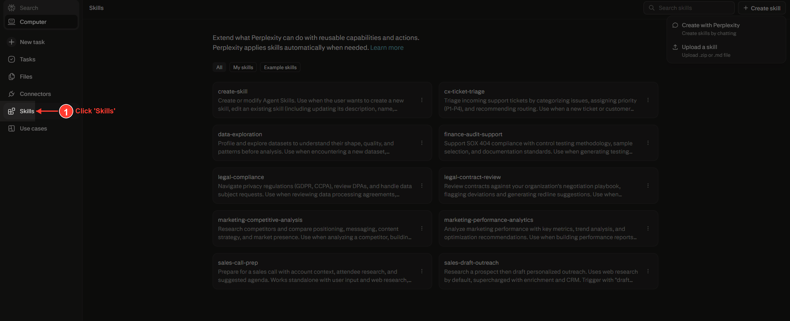
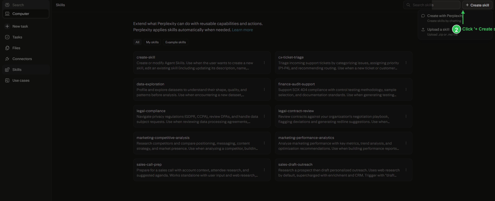
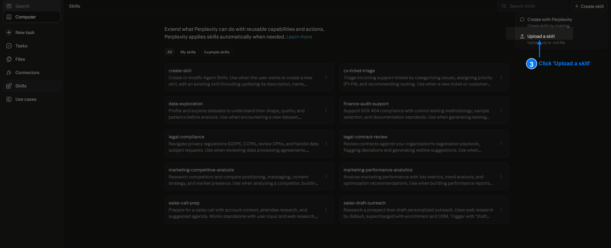
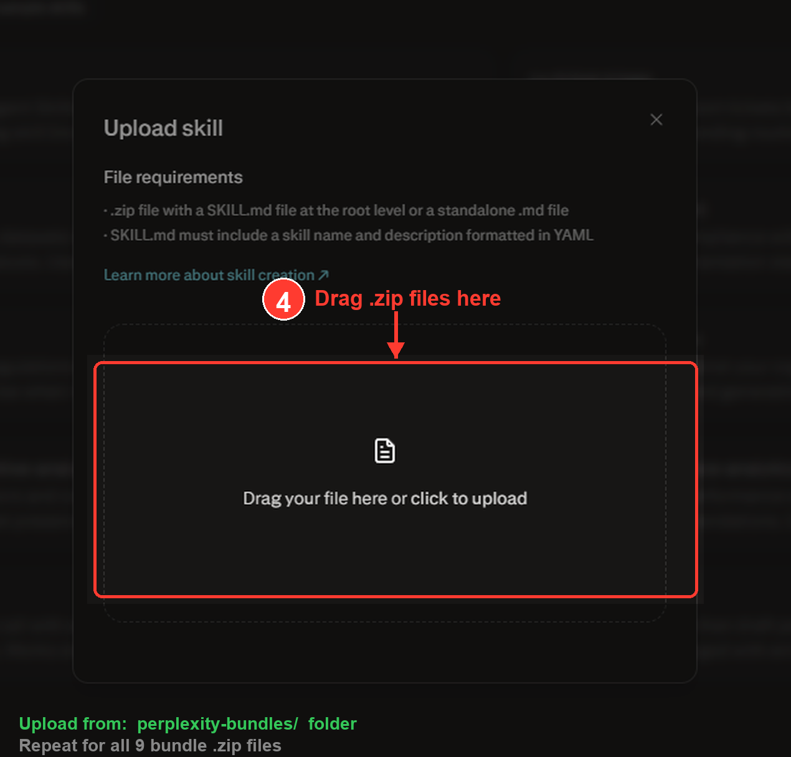

# Consulting Pro Skills Pack

**83 consulting skills** for Perplexity Computer -- 9 uploads and you're done.

---

## How to Install (5 minutes)

### Step 1: Download

Click the green **Code** button at the top of this page, then **Download ZIP**. Unzip it on your computer.

### Step 2: Click "Skills" in the sidebar

### Step 3: Click "+ Create skill"

### Step 4: Click "Upload a skill"

### Step 5: Drag a bundle .zip into the upload box

Drag a `.zip` file from the `perplexity-bundles/` folder. Repeat for each bundle (9 total).

### The 9 bundles to upload

| Bundle | Skills | What It Covers |
|--------|--------|---------------|
| `c-suite-advisory.zip` | 19 | CEO, CFO, CMO, COO, CPO, CRO, CTO advisors, board meetings, competitive intel, M&A, strategy |
| `marketing-growth.zip` | 22 | Marketing strategy, copywriting, SEO, ads, email, social media, pricing, launch |
| `product-research.zip` | 8 | Product management, discovery, analytics, UX research, competitive teardowns |
| `business-sales.zip` | 4 | Contracts, proposals, customer success, revenue ops, sales engineering |
| `finance-investing.zip` | 3 | Financial analysis, SaaS metrics, pitch decks, investor materials |
| `startup-entrepreneur.zip` | 6 | MVP, first customers, company values, sustainable growth |
| `web-design-deliverables.zip` | 5 | Presentations, 3D websites, video heroes, landing pages |
| `technical-delivery.zip` | 12 | Python, testing, Docker, deployment, PostgreSQL, security, project management |
| `outreach-communication.zip` | 3 | Investor outreach, market research, codebase-to-course |

That's it. Perplexity will automatically use the right skills when your task matches.

Want just one specific skill instead? The `perplexity-zips/` folder has each skill as its own zip.

---

## What's Inside

### C-Suite & Executive Advisory (19 skills)

| Skill | What It Does |
|-------|-------------|
| **ceo-advisor** | Strategic leadership, vision, fundraising, board management |
| **cfo-advisor** | Financial strategy, treasury, compliance, investor reporting |
| **cmo-advisor** | Brand strategy, growth marketing, market positioning |
| **coo-advisor** | Operations, process optimization, scaling |
| **cpo-advisor** | Product vision, roadmap strategy, product-market fit |
| **cro-advisor** | Revenue strategy, sales operations, pipeline optimization |
| **cto-advisor** | Technical strategy, architecture decisions, engineering leadership |
| **executive-mentor** | Coaching executives through hard decisions, board prep, postmortems |
| **founder-coach** | Founder-specific guidance for early-stage through growth |
| **board-deck-builder** | Create board-ready presentation decks |
| **board-meeting** | Board meeting preparation, agenda, follow-ups |
| **change-management** | Organizational change planning and execution |
| **competitive-intel** | Competitive landscape analysis and strategic positioning |
| **internal-narrative** | Craft internal communications and company narratives |
| **ma-playbook** | M&A strategy, due diligence, integration planning |
| **intl-expansion** | International market entry strategy |
| **org-health-diagnostic** | Organizational health assessment and improvement |
| **scenario-war-room** | War-game scenarios for strategic planning |
| **strategic-alignment** | Align teams around strategy, OKRs, and priorities |

### Marketing & Growth (22 skills)

| Skill | What It Does |
|-------|-------------|
| **marketing-strategy-pmm** | Product marketing strategy, positioning, GTM |
| **content-strategy** | Content planning, editorial calendars, content pillars |
| **content-engine** | Multi-platform content repurposing system |
| **copywriting** | Persuasive copy for ads, landing pages, emails |
| **copy-editing** | Professional editing for clarity, tone, grammar |
| **cold-email** | B2B cold outreach sequences that actually get replies |
| **email-sequence** | Lifecycle email sequences for nurturing leads |
| **social-media-manager** | Social media strategy and execution across platforms |
| **brand-guidelines** | Brand identity, voice, visual standards |
| **campaign-analytics** | Marketing campaign measurement and optimization |
| **ai-seo** | AI-powered SEO strategy and content optimization |
| **seo-audit** | Technical and content SEO audits |
| **paid-ads** | Paid advertising strategy across Google, Meta, LinkedIn |
| **ad-creative** | Ad creative development and testing frameworks |
| **pricing-strategy** | Pricing models, value-based pricing, competitive pricing |
| **launch-strategy** | Product and feature launch planning |
| **churn-prevention** | Customer churn analysis and retention strategies |
| **referral-program** | Referral and affiliate program design |
| **competitor-alternatives** | Competitive comparison and differentiation |
| **marketing-psychology** | Psychological principles for persuasive marketing |
| **article-writing** | Long-form articles, guides, blog posts |
| **humanize-writing** | Remove AI tells from any writing |

### Product & Research (8 skills)

| Skill | What It Does |
|-------|-------------|
| **product-manager-toolkit** | Product management frameworks and templates |
| **product-discovery** | User research, problem validation, opportunity sizing |
| **product-strategist** | Product strategy, vision, competitive positioning |
| **product-analytics** | Product metrics, funnel analysis, user behavior |
| **competitive-teardown** | Deep competitive product analysis |
| **research-summarizer** | Synthesize research into actionable summaries |
| **roadmap-communicator** | Communicate roadmaps to stakeholders |
| **ux-researcher-designer** | UX research methods, usability testing, design thinking |

### Business Development & Sales (4 skills)

| Skill | What It Does |
|-------|-------------|
| **contract-and-proposal-writer** | Contracts, proposals, SOWs, NDAs, MSAs across jurisdictions |
| **customer-success-manager** | Customer retention, expansion, health scoring |
| **revenue-operations** | Revenue pipeline, forecasting, sales-marketing alignment |
| **sales-engineer** | Technical sales support, demos, proof of concepts |

### Finance & Metrics (3 skills)

| Skill | What It Does |
|-------|-------------|
| **financial-analyst** | Financial modeling, analysis, forecasting |
| **saas-metrics-coach** | SaaS metrics (MRR, ARR, LTV, CAC, churn) |
| **investor-materials** | Pitch decks, one-pagers, financial models |

### Startup & Entrepreneurship (6 skills)

Based on [The Minimalist Entrepreneur](https://github.com/slavingia/skills) by Sahil Lavingia:

| Skill | What It Does |
|-------|-------------|
| **find-community** | Identify communities to build a business around |
| **mvp** | Build minimum viable products (manual first) |
| **first-customers** | Strategy for selling to your first 100 customers |
| **grow-sustainably** | Sustainable, profitable growth decisions |
| **company-values** | Define company values and culture |
| **minimalist-review** | Gut-check any business decision |

### Client Deliverables & Web (5 skills)

| Skill | What It Does |
|-------|-------------|
| **frontend-slides** | Animation-rich HTML presentations |
| **overkill-web-design** | Transform websites into $50k experiences |
| **3d-immersive** | 3D interactive websites with React Three Fiber |
| **video-hero** | Video background landing pages |
| **landing-page-generator** | Generate high-converting landing pages |

### Technical Delivery (12 skills)

| Skill | What It Does |
|-------|-------------|
| **python-patterns** | Clean Python code patterns |
| **python-testing** | pytest, TDD, fixtures, mocking |
| **tdd-workflow** | Test-driven development enforcement |
| **postgres-patterns** | PostgreSQL optimization and design |
| **database-migrations** | Schema changes, rollbacks, zero-downtime |
| **docker-patterns** | Docker Compose, container patterns |
| **deployment-patterns** | CI/CD, health checks, rollback strategies |
| **e2e-testing** | Playwright E2E testing patterns |
| **codebase-context** | Rolling project map across sessions |
| **security-review** | Security checklist before deployment |
| **openai-tools** | DALL-E, GPT-4o, TTS, Whisper, embeddings patterns |
| **codebase-to-course** | Turn any codebase into an interactive HTML course for clients |

### Outreach & Communication (2 skills)

| Skill | What It Does |
|-------|-------------|
| **investor-outreach** | Cold emails, warm intros for fundraising |
| **market-research** | Competitive analysis, market sizing, industry intel |

### Project Management (2 skills)

| Skill | What It Does |
|-------|-------------|
| **senior-pm** | Senior project management practices |
| **scrum-master** | Agile/Scrum facilitation and coaching |

---

## Credits

Skills sourced from:
- Custom skills by [@UnlimitedxIQ](https://github.com/UnlimitedxIQ)
- [alirezarezvani/claude-skills](https://github.com/alirezarezvani/claude-skills) (MIT) -- C-level, marketing, finance, product, project management
- [slavingia/skills](https://github.com/slavingia/skills) -- The Minimalist Entrepreneur
- [zarazhangrui/codebase-to-course](https://github.com/zarazhangrui/codebase-to-course) -- Codebase to interactive course

## License

MIT
